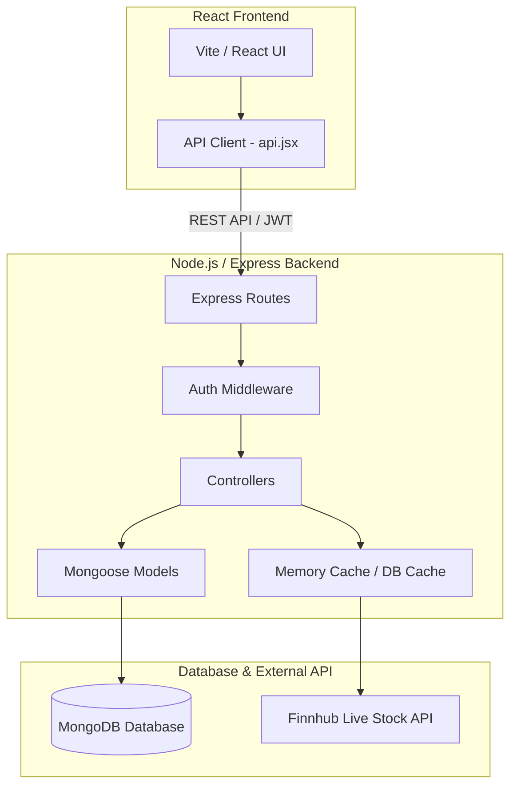
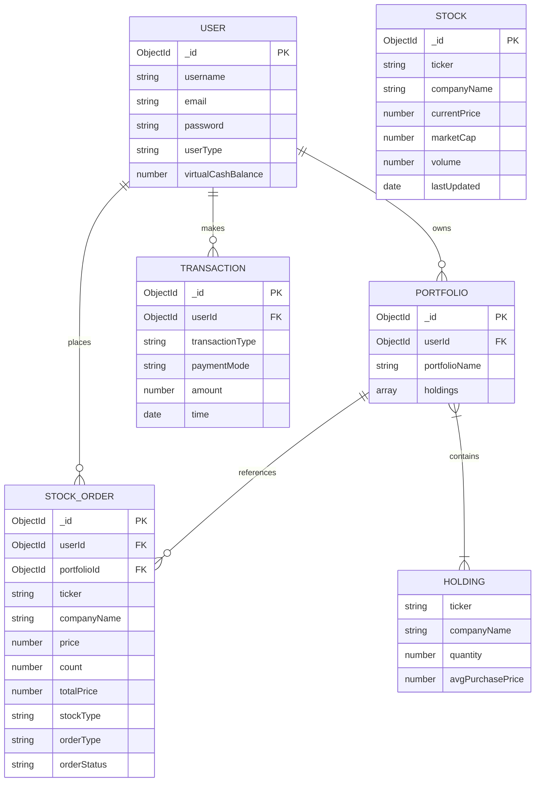
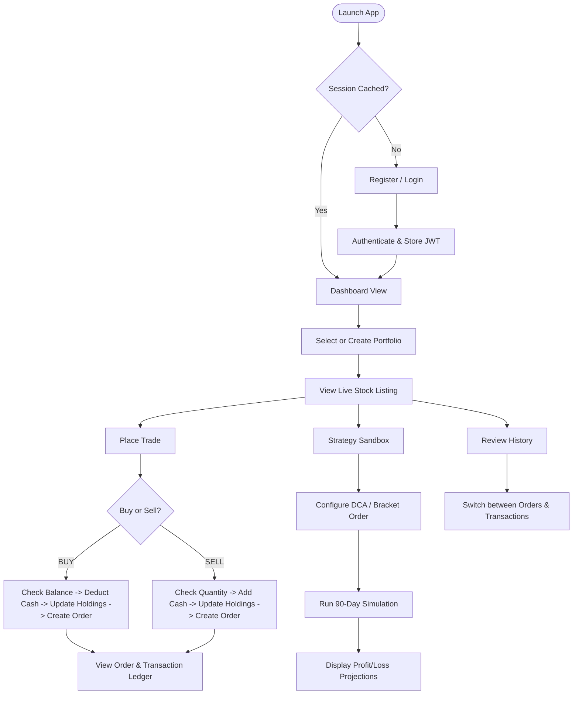

# Virtual Stock Trading Application

A feature-rich, full-stack Virtual Stock Trading Application designed to simulate real-world stock trading. The application utilizes a modern React frontend and a Node.js/Express/MongoDB backend, featuring live stock price caching via the Finnhub API and a Strategy Sandbox simulator for backtesting.

---

## 🏗️ Project Architecture

The application is built using a decoupled Client-Server architecture. The frontend serves the interactive user interface, while the backend exposes a REST API to manage business logic and persist data in MongoDB.



### Key Architectural Characteristics
- **State Management & Caching:** The server caches live stock prices retrieved from the Finnhub API for **1 minute** inside MongoDB to stay within rate limits and optimize latency.
- **Security:** Session management is handled using JSON Web Tokens (JWT) signed by the backend and stored in the client's local storage.
- **Strategy Sandbox:** Run client-side arithmetic Brownian motion simulations to project stock values over 90 days for backtesting strategies (like DCA and Bracket orders).

---

## 📊 Entity Relationship (ER) Diagram

The system employs a relational Mongoose schema structure modeled in MongoDB. Relationships are established via ObjectIds acting as references.



---

## 🌟 Key Features

1. **User Authentication & Session Management:**
   - Registration and Login with encrypted passwords (via `bcrypt`).
   - JWT-based persistent sessions.
2. **Multi-Portfolio Management:**
   - Create custom portfolios to organize and isolate different investment approaches.
   - Live tracking of holdings, average purchase price, and total valuation.
3. **Live Price Integration & Caching:**
   - Fetches live market updates using Finnhub Stock API.
   - Built-in caching on the database layer updates prices at most once per minute to avoid API threshold breaches.
4. **Mock Stock Trading:**
   - Place instantaneous `BUY` and `SELL` orders using virtual cash.
   - Automatic calculations for cost basis (average purchase price) and balance deductions/credit.
5. **Strategy Sandbox Simulator:**
   - Backtest investment strategies under simulated market conditions using standard random walk projections.
   - **Dollar Cost Averaging (DCA):** Input monthly/weekly allocations to compute average cost and final portfolio value.
   - **Bracket Orders:** Set `Take Profit` and `Stop Loss` targets to calculate risk-reward ratios.
6. **Detailed Audit Trails:**
   - Order history tracking completed and failed orders.
   - Transaction ledger keeping record of all financial operations.

---

## 🔄 User Flow

The typical journey of a user interacting with the platform is modeled as follows:



---

## 👥 Roles and Responsibilities

### User Access Roles
- **Standard User:** Can register, manage portfolios, trade mock stocks, view cash balances, run strategy simulations, and check personal order/transaction history.
- **Admin:** Holds elevated privileges. In addition to regular user abilities, admins can fetch portfolio information across any user boundary for administrative auditing.

### System Layer Responsibilities

| Layer / Component | Primary Responsibilities |
| :--- | :--- |
| **Frontend (React Client)** | Renders interactive charts/tables, performs client-side validation, handles local storage sessions, runs sandbox simulations, and connects to the backend API. |
| **Backend (Express Server)** | Exposes REST endpoints, validates JWT authentication, manages database connection pools, fetches and caches external API pricing. |
| **Database (MongoDB)** | Persists records for users, portfolios, stocks, transaction histories, and orders. Enforces data integrity through Mongoose schemas. |

---

## 🛠️ MVC (Model-View-Controller) Pattern Implementation

The backend follows the standard **MVC (Model-View-Controller)** pattern (with the client UI acting as the View layer) to separate concerns and ensure maintainable code.

```
📁 stock-trading-app
├── 📁 client
│   └── 📁 src
│       ├── App.jsx             <-- VIEW (React User Interface)
│       └── api.jsx             <-- API client layer connecting View to Controllers
└── 📁 server
    └── 📁 src
        ├── 📁 models           <-- MODEL (Database schemas & data representations)
        │   ├── userModel.js
        │   ├── portfolioModel.js
        │   ├── stockSchema.js
        │   ├── orderSchema.js
        │   └── transactionModel.js
        ├── 📁 routes           <-- ROUTER (Bridges HTTP endpoints to Controllers)
        │   ├── userRoute.js
        │   ├── orderRoute.js
        │   ├── stockRoute.js
        │   └── transactionRoute.js
        └── 📁 controllers      <-- CONTROLLER (Core business logic orchestrating Models & Views)
            ├── userController.js
            ├── orderController.js
            ├── stockController.js
            └── transactionController.js
```

### 1. Model
Defines the database schema structure, validators, and relationships using Mongoose.
* **Location:** [server/src/models/](file:///d:/All%20projects/Virtual-Stock-Trading-App/server/src/models/)
* **Example:** `userModel.js` specifies fields like `username`, `email`, `password`, `userType`, and `virtualCashBalance`, ensuring required validation.

### 2. View
The visual interface for users to interact with. Built using React and styled with custom CSS.
* **Location:** [client/src/App.jsx](file:///d:/All%20projects/Virtual-Stock-Trading-App/client/src/App.jsx)
* **Description:** Represents dynamic component states for dashboards, stock price lists, trading modals, historical grids, and visual simulation charts (via SVGs).

### 3. Controller
Contains the business logic to process requests, interact with models, and return appropriate responses.
* **Location:** [server/src/controllers/](file:///d:/All%20projects/Virtual-Stock-Trading-App/server/src/controllers/)
* **Example:** `orderController.js` handles placing trade orders by validating virtual cash balances, updating portfolios, modifying user balances, and logging transaction events.

### 4. Router (Bridge)
Directs HTTP requests from the View (via the API client) to the correct controller methods.
* **Location:** [server/src/routes/](file:///d:/All%20projects/Virtual-Stock-Trading-App/server/src/routes/)
* **Example:** `orderRoute.js` maps `POST /api/trade/order` to `orderController.createOrder`.
