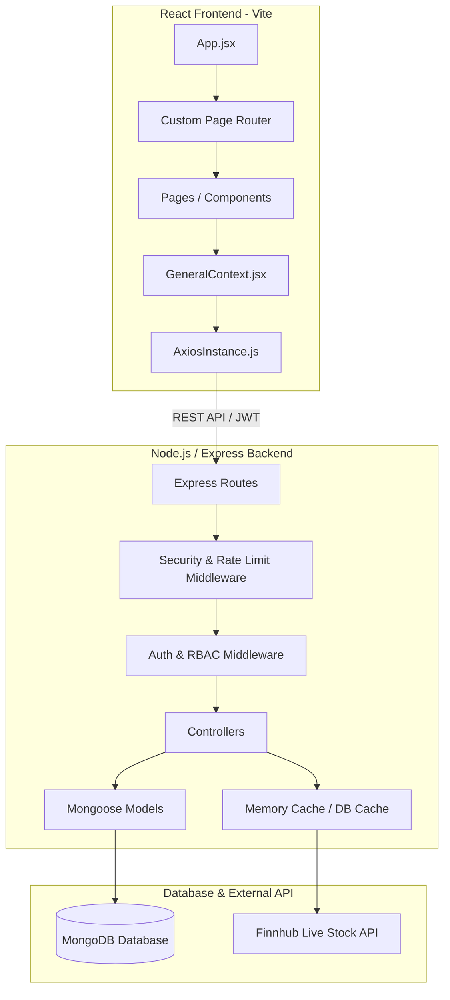
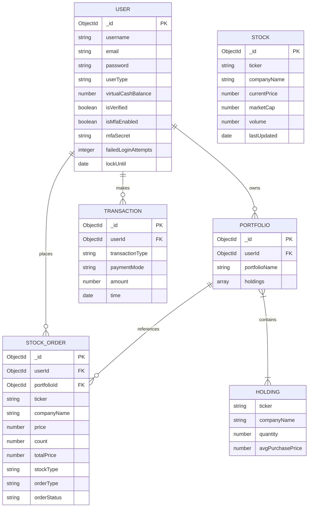

# SB Stocks - Virtual Stock Trading Application

A feature-rich, full-stack Virtual Stock Trading Application designed to simulate real-world stock trading. The application utilizes a modular React frontend (Vite) and a Node.js/Express/MongoDB backend, featuring live stock price caching via the Finnhub API, a Strategy Sandbox simulator for backtesting, and production-grade security hardening.

---

## 🏗️ Project Architecture

The application is built using a decoupled Client-Server architecture. The frontend serves the interactive user interface, while the backend exposes a REST API to manage business logic and persist data in MongoDB.



### Key Architectural Characteristics
- **Modular Design**: The frontend is split into structured folders for components, pages, and a global state context provider.
- **State Management & Caching**: The server caches live stock prices retrieved from the Finnhub API for **1 minute** inside MongoDB to stay within rate limits and optimize latency.
- **Session Security**: Session management is handled using JSON Web Tokens (JWT) signed by the backend and stored in the client's local storage, with an authorization interceptor in Axios.
- **Strategy Sandbox**: Run client-side arithmetic Brownian motion simulations to project stock values over 90 days for backtesting strategies (like DCA and Bracket orders).

### 1. Model
Defines the database schema structure, validators, and relationships using Mongoose.
* **Example:** `userModel.js` specifies fields like `username`, `email`, `password`, `userType`, and `virtualCashBalance`, ensuring required validation.

### 2. View
The visual interface for users to interact with. Built using React and styled with custom CSS.
* **Description:** Represents dynamic component states for dashboards, stock price lists, trading modals, historical grids, and visual simulation charts (via SVGs).

### 3. Controller
Contains the business logic to process requests, interact with models, and return appropriate responses.
* **Example:** `orderController.js` handles placing trade orders by validating virtual cash balances, updating portfolios, modifying user balances, and logging transaction events.

### 4. Router (Bridge)
Directs HTTP requests from the View (via the API client) to the correct controller methods.
* **Example:** `orderRoute.js` maps `POST /api/trade/order` to `orderController.createOrder`.

---

## 🛡️ Security Hardening Features

The application incorporates a robust security profile implemented natively on the MERN stack:
1. **Login Lockout Protection**: Accounts are temporarily locked for 15 minutes after 5 consecutive failed login attempts to prevent brute-force attacks.
2. **Multi-Factor Authentication (MFA)**: Built-in Time-based One-Time Password (TOTP) security using the standard `speakeasy` package, generating setup QR codes via `qrcode` and validating codes on login.
3. **Cryptographic Signup Verification**: Users are registered as unverified and must activate their account using a secure, cryptographically random token sent via URL parameters.
4. **NoSQL Injection Prevention**: Integrated `express-mongo-sanitize` on the backend to filter all user payloads.
5. **HTTP Header & CORS Locks**: Loaded `helmet` to automate security headers, and restricted CORS origins strictly to `http://localhost:5173`.
6. **API Rate Limiters**: Restricts general API requests to 100 requests per 15 minutes, and authentication routes to 5 requests per minute.
7. **Production Error Masking**: Custom global exception middleware prevents backend source stack traces from leaking to clients.
8. **Winston Audit Loggers**: Security incidents (lockouts, 2FA setup, failed logins) are recorded in `server/logs/security.log`, while runtime exceptions write to `server/logs/error.log`.

---

## 📊 Entity Relationship (ER) Diagram

The system employs a relational Mongoose schema structure modeled in MongoDB. Relationships are established via ObjectIds acting as references.



---

## 🌟 Key Features

1. **User Authentication & Session Management:**
   - Registration and Login with encrypted passwords (via `bcrypt`).
   - JWT-based persistent sessions with short-lived tokens (1 hour).
2. **Multi-Portfolio Management:**
   - Create custom portfolios to organize and isolate different investment approaches.
   - Live tracking of holdings, average purchase price, and total valuation.
3. **Live Price Integration & Caching:**
   - Fetches live market updates using Finnhub Stock API.
   - Built-in caching on the database layer updates prices at most once per minute to avoid API threshold breaches.
4. **Mock Stock Trading:**
   - Place instantaneous `BUY` and `SELL` orders using virtual cash.
   - Automatic calculations for cost basis (average purchase price) and balance deductions/credit.
5. **Strategy Sandbox Simulator:**
   - Backtest investment strategies under simulated market conditions using standard random walk projections.
   - **Dollar Cost Averaging (DCA):** Input monthly/weekly allocations to compute average cost and final portfolio value.
   - **Bracket Orders:** Set `Take Profit` and `Stop Loss` targets to calculate risk-reward ratios.
6. **Detailed Audit Trails:**
   - Order history tracking completed and failed orders.
   - Transaction ledger keeping record of all financial operations.

---

## 👑 Access Roles

- **Standard User (Trader):** Can register, manage portfolios, trade mock stocks, view cash balances, run strategy simulations, setup 2FA, and check personal order/transaction history.
- **Admin:** Holds elevated privileges. Can view the **Admin Panel** to monitor total system liquidity, comparative index charts, all user account parameters (including verification and MFA status), and all global order and transaction logs.

---

## 🛠️ File Structure

The project follows a modular, organized MERN structure:

```
📁 stock-trading-app
├── 📁 client                   <-- FRONTEND REACT APP (Vite)
│   ├── 📁 public
│   │   ├── hero-illustration.png
│   │   └── logo.png            <-- Custom Brand Logo & Favicon
│   ├── 📁 src
│   │   ├── 📁 components       <-- Shared UI components
│   │   │   ├── axiosInstance.js
│   │   │   ├── Login.jsx
│   │   │   ├── Register.jsx
│   │   │   └── Navbar.jsx
│   │   ├── 📁 context          <-- Global context state provider
│   │   │   └── GeneralContext.jsx
│   │   ├── 📁 pages            <-- Route Page views
│   │   │   ├── Landing.jsx
│   │   │   ├── Home.jsx
│   │   │   ├── Portfolio.jsx
│   │   │   ├── Profile.jsx
│   │   │   ├── History.jsx
│   │   │   ├── StockChart.jsx
│   │   │   ├── Admin.jsx
│   │   │   ├── Users.jsx
│   │   │   ├── AllOrders.jsx
│   │   │   ├── AllTransactions.jsx
│   │   │   └── AdminStockChart.jsx
│   │   ├── App.jsx             <-- View Router Orchestrator
│   │   ├── App.css             <-- Custom styling rules
│   │   └── main.jsx
│   └── index.html
└── 📁 server                   <-- BACKEND EXPRESS SERVER
    ├── 📁 logs                 <-- Winston Log folder
    │   ├── error.log
    │   └── security.log
    └── 📁 src
        ├── 📁 models           <-- Mongoose Database Schemas
        ├── 📁 routes           <-- Router routes
        ├── 📁 controllers      <-- Business logic handlers
        ├── 📁 middlewares      <-- Auth, admin validation, & security middlewares
        ├── config/db.js        <-- DB Connection & Seeding script
        └── server.js           <-- Server start core
```

---

## ⚙️ Setup & Running Locally

### Prerequisites
- [Node.js](https://nodejs.org/) (v16+ recommended)
- [MongoDB](https://www.mongodb.com/) installed locally and running on port `27017`

### 1. Backend Server Configuration
1. Open a terminal and navigate to the server folder:
   ```bash
   cd server
   ```
2. Install dependencies:
   ```bash
   npm install
   ```
3. Create a `.env` file in the `server` root directory:
   ```env
   PORT=5000
   MONGO_URI=your_mongodb_url_here
   JWT_SECRET=your_super_secret_key_here
   FINNHUB_API_KEY=your_finnhub_api_key_here
   ```
4. Start the backend server:
   ```bash
   npm start
   ```

### 2. Frontend Client Configuration
1. Open a new terminal and navigate to the client folder:
   ```bash
   cd client
   ```
2. Install dependencies:
   ```bash
   npm install
   ```
3. Start the Vite development server:
   ```bash
   npm run dev
   ```
4. Open your browser and navigate to `http://localhost:5173/`.
